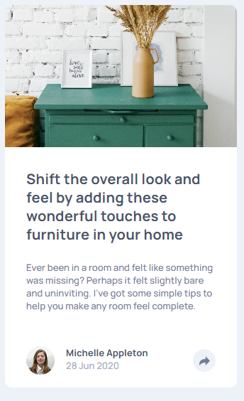
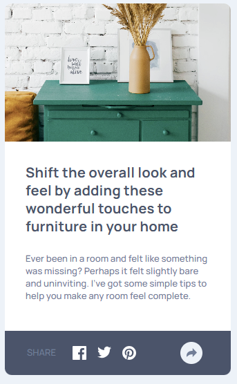
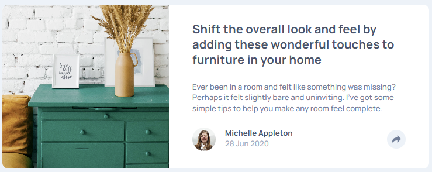
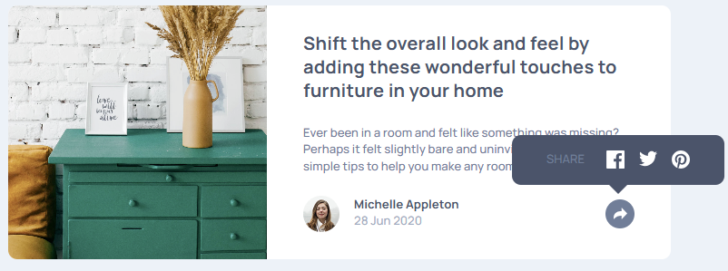

# Article Preview Component

## Descripción
Este repositorio contiene la solución al reto **“Article Preview Component”** de Frontend Mentor. El propósito de este proyecto es practicar la maquetación responsive y la interacción básica con JavaScript para mostrar/ocultar elementos de forma dinámica.

## Capturas de Pantalla

  <strong>Vista móvil</strong> 
  

  <strong>Vista móvil activa</strong> 
  

  <strong>Vista escritorio</strong> 
  

  <strong>Vista escritorio</strong> 
  

## Tecnologías Utilizadas
- **HTML5**: Estructura semántica del componente.
- **Sass (SCSS)**: Preprocesador CSS para organizar variables, mixins y estilos modularizados.
- **JavaScript (Vanilla JS)**: Para manejar la lógica de mostrar/ocultar la sección de “Share”.
- **Manrope** (Google Fonts): Fuente tipográfica principal.
- **Frontend Mentor**: Guía y diseño base para el componente.

## Retos y Aprendizajes
- **Recorte de Imagen Responsive**

- Ajustar object-position y object-fit en distintos tamaños para que la parte deseada de la imagen principal siempre sea visible en los recortes de móvil, tablet y escritorio.

- Posicionamiento del Popup en Desktop

- En pantallas anchas, el popup de “Share” se coloca por encima de la sección inferior del componente y se hace apuntar mediante un triángulo CSS (pseudoelemento ::after).

- Fue necesario usar position: absolute dentro de un contenedor posicionado (position: relative en .container__social) y ajustar bottom, left y transform.

- Mixins de Sass y Adaptabilidad

- Crear un mixin genérico de Flexbox simplificó la escritura de display: flex; flex-direction: …; gap: … en múltiples bloques.

- Comprender cómo usar @content dentro de mixins de breakpoint (@mixin tablet { @content; }) para agrupar estilos responsivos.

- Manejo de Clases BEM

- Seguir el patrón BEM (Bloque__Elemento--Modificador) ayudó a mantener el CSS organizado y fácil de escalar si se agregaran más variantes de diseño.